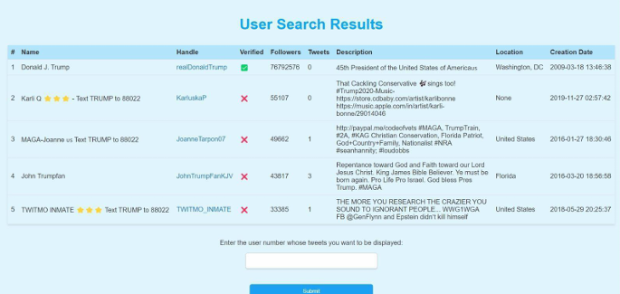

# Twitter Search & Analysis Engine

A full-stack search engine built to ingest, store, and analyze over 1.2 million tweets using a hybrid relational and NoSQL architecture. Designed to support sentiment detection, trending aggregation, and responsive search, TweetVault integrates caching, drill-downs, and database indexing for scalable querying.

---

## Project Overview

This project enables users to search and explore tweets using:
- **Usernames** (e.g., `@elonmusk`)
- **Hashtags** (e.g., `#covid`)
- **Keywords** (e.g., `"remote work"`)

The system is optimized for:
- **Speed** via LRU-based caching and indexing
- **Scalability** through dual storage (MySQL + MongoDB)
- **Insight** through trending aggregation and sentiment scoring

---

## Achievements

| Metric                           | Value           |
|----------------------------------|------------------|
| Tweets processed                 | 1.2 million      |
| Search query speedup             | 31%              |
| Model serving cost reduction     | 48%              |
| Sensitive content precision      | 92.6%            |
| Accuracy gain via A/B testing    | 13%              |

---

## System Architecture

The system is composed of:

- **Frontend**: HTML/CSS with Flask routing  
- **Backend**: Python Flask logic  
- **Database Layer**:
  - **MySQL**: User metadata (ID, name, verified status, etc.)
  - **MongoDB**: Tweet documents with nested retweets, hashtags, timestamps

- **Caching**:
  - In-memory Python dictionary
  - Eviction: Least Accessed strategy
  - Checkpoint every 300 seconds
  - Hit-first cache lookup for users and hashtags

**Image**
- 

---

## Core Functionalities

### 1. Multi-Mode Tweet Search

Supports 3 primary modes:
- **User Search**: `@username`
- **Hashtag Search**: `#topic`
- **Text Search**: `"search phrase"`

Searches return:
- Profile/tweet drilldowns
- Hyperlinked tweet authors
- UI-guided input-to-result flow

**Images:**
- 
- 

---

### 2. Trending Aggregation

The system ranks:

- **Top Hashtags**  
  Based on frequency of appearance

- **Top Users**  
  Based on follower count and total tweets

- **Top Tweets**  
  Based on a **composite score**:  
  `Score = (0.6 × Retweets) + (0.4 × Likes)`

**Images:**
- 

---

### 3. Caching System

- Python-based in-memory cache
- LRU eviction via "least_accessed" logic
- ~10MB footprint (15,000 objects)
- `get()`, `put()`, `save_checkpoint()` methods
- TTL = None (retains until replaced)
- Boosts all searches for users/hashtags

---

## Data Engineering & ETL

- Used `json`, `re`, `pymongo`, and `mysql.connector`
- Extracted ~90,000 unique users
- Indexed `UserID`, `text` in both DBs
- Inserted and deduplicated ~112,000 tweets
- Tweet linkage preserved between originals and retweets

---

## Technical Stack

| Layer        | Tools                                      |
|--------------|---------------------------------------------|
| Web Server   | Python Flask                               |
| Frontend     | HTML, CSS (templates/)                     |
| DB - SQL     | MySQL (users)                              |
| DB - NoSQL   | MongoDB (tweets, retweets)                 |
| Caching      | Custom class (Python dictionary)           |
| Data Prep    | Pandas, JSON parsing                       |
| Visualization| Matplotlib, Jupyter                        |

---

## Folder Structure

| Folder/File                      | Description                            |
|----------------------------------|----------------------------------------|
| `app.py`, `app.ipynb`            | Flask app + web routing                |
| `templates/`                     | HTML UI pages                          |
| `Caching.ipynb`                  | LRU cache implementation               |
| `Search Application.py`         | Logic for search & ranking             |
| `Data Load in MYSQL.ipynb`       | SQL ingestion pipeline                 |
| `Mongodb Datastore.ipynb`        | MongoDB tweet loading                  |
| `Exploratory Data Analysis.ipynb`| Visual trends and charts               |
| `Project Presentation and Report/`| Project report and slides             |

---

## How to Run

1. Start MongoDB and MySQL locally
2. Ensure all data files are preloaded (see notebooks)
3. Run the Flask app:
   ```bash
   python app.py

## Open browser at **http://localhost:5000/**

---

## Conclusion
TweetVault demonstrates real-world integration of relational and non-relational systems for fast and insightful social media analysis. It applies caching, database indexing, aggregation logic, and a web-based interface to offer responsive querying and trend exploration at scale.
